## Code structure
- Program begins by calling App class and running the Run function that implements all the other parts of the program mainly split across environment and terminal.
- The terminal handles user inputs and calling of commands, which are structured by classes inside command folder. Each Command inherits form ICommandable for unified structure.
- Environment handles planets (SpaceObject) and the satellite. They are grouped by the World class, but a lot of other classes access satellite directly for convenience.
- Print class handles custom print function, allowing for easy debug toggle and full control over printing.
- FileRegenerator class handles regeneration of program file saving data in the case that they are either missing entirely or in a bad format.

```mermaid
classDiagram
    %% Interfaces
    class ICommandable {
        <<interface>>
        +Terminal Term
        +string Name
        +Run(List~string~) string
    }

    class ISatellitePartable {
        <<interface>>
        +string Name
        +string Type
        +char Size
        +int Weight
        +int Hp
    }

    class IDegradeable {
        <<interface>>
        +int DegradeTime
    }

    %% Main Classes
    class App {
        -bool Debug
        +Run() void
        +RunTerminal(Terminal) void
        +RunEnviroment(Terminal, Satellite) void
    }

    class Terminal {
        -List~ICommandable~ CommandList
        -string TerminalString
        -World VirtualWorld
        -Satellite Satellite
        +Terminal(List~ICommandable~, string, World, Satellite)
        +static ParseCommand(string) List~string~
        +Run() void
    }

    %% Static Utility Classes
    class Print {
        <<static>>
        +static bool Debug
        +static Out(string) void
        +static Out(string, ConsoleColor) void
        +static OutLn(string) void
        +static OutLn(string, ConsoleColor) void
        +static OutLn(string, ConsoleColor, ConsoleColor) void
        +static OutDebug(string) void
        +static ReadLn() string
        +static ReadKey() ConsoleKey
        +static Clear() void
    }

    class Menu {
        <<static>>
        +static SelectMultiple(string, List~string~) List~int~
        +static YNoption(string, char) bool
    }

    class Warp {
        <<static>>
        +static int MissionTime
        +static Satellite Sat
        +static SkipTime(int) bool
    }

    class PointsManager {
        <<static>>
        +static AddPoints(int) void
        +static GetPoints() int
        +static ResetPoints() void
    }

    class FileRegenerator {
        <<static>>
        -static PingFile(string) void
        +static CheckSavedFiles() void
        +static RegenerateFiles() void
    }

    %% Satellite System Classes
    class Satellite {
        -string Name
        -bool IsConfigured
        -double UnifiedFuelAmount
        -World SolarSystem
        -SatelliteBuilder Builder
        -PositionTracker PosTracker
        -List~SatBattery~ SatBattery
        -List~SatFuelTank~ SatFuelTank
        -List~SatEngine~ SatEngine
        +Satellite()
        +GetAcceleration() double
        +UnifyFuel() void
        +ChangeOrbitalHeight(int) string
        +ChangeOrbitalSpeed(double) string
        +SnapOrbit(double, double) string
        +ChangePosition(string, int) string
        +Reset() void
    }

    class World {
        -List~SpaceObject~ OrbitingObjects
        -SpaceObject CentralObject
        -Satellite Sat
        +World(List~SpaceObject~, SpaceObject, Satellite)
    }

    class SpaceObject {
        -string Name
        -int Distance
        -double Weight
        -int Diameter
        -double OrbitalPos
        -double AngularSpeed
        -double PointsMultiplier
        +SpaceObject(string, int, double, int, double, double)
        +AddOrbitalPos(double) double
        +CalculateOrbitalPos(double) double
        +ToString() string
    }

    class PositionTracker {
        -int Distance
        -double OrbitalPos
        -double AngularSpeed
        +PositionTracker(int, double)
        +AddOrbitalPos(double) double
        +CalculateOrbitalPos(double) double
    }

    class SatelliteBuilder {
        -List~SatBattery~ SatBatteryList
        -List~SatFuelTank~ SatFuelTankList
        -List~SatEngine~ SatEngineList
        +SatelliteBuilder()
        +LoadFilesSafe() void
        -LoadFiles() void
    }

    %% Satellite Parts
    class SatBattery {
        -string Name
        -string Type
        -char Size
        -int Weight
        -int DegradeTime
        -int Hp
        -int BatteryLevel
        -int Capacity
        -int MaxChargeLevel
        +SatBattery(string, string, char, int, int, int, int, int, int)
        +RecalculateMaxChargeLevel() void
    }

    class SatEngine {
        -string Name
        -string Type
        -char Size
        -int Weight
        -int Hp
        -int Thrust
        -string FuelType
        -int FuelConsumption
        +SatEngine(string, string, char, int, int, int, string, int)
    }

    class SatFuelTank {
        -string Name
        -string Type
        -char Size
        -int Weight
        -int Hp
        -int Capacity
        -int FuelLevel
        -int AdditionalWeight
        -int FuelWeightPerKg
        +SatFuelTank(string, string, char, int, int, int, int)
        +RecalculateAdditionalWeight() void
    }

    %% Commands
    class ClearCommand {
        -Terminal Term
        -string Name
        +ClearCommand(Terminal, string)
        +Run(List~string~) string
    }

    class DebugCommand {
        -Terminal Term
        -string Name
        +DebugCommand(Terminal, string)
        +Run(List~string~) string
    }

    class HelpCommand {
        -Terminal Term
        -string Name
        +HelpCommand(Terminal, string)
        +Run(List~string~) string
        +LoadHelperFile(string) string
    }

    class NeofetchCommand {
        -Terminal Term
        -string Name
        +NeofetchCommand(Terminal, string)
        +Run(List~string~) string
    }

    class WhoAmICommand {
        -Terminal Term
        -string Name
        +WhoAmICommand(Terminal, string)
        +Run(List~string~) string
    }

    class TimeCommand {
        -Terminal Term
        -string Name
        +TimeCommand(Terminal, string)
        +Run(List~string~) string
    }

    class ObjectsCommand {
        -Terminal Term
        -string Name
        +ObjectsCommand(Terminal, string)
        +Run(List~string~) string
    }

    class PointsCommand {
        -Terminal Term
        -string Name
        +PointsCommand(Terminal, string)
        +Run(List~string~) string
    }

    class SatelliteCommand {
        -Terminal Term
        -string Name
        -string _returnValue
        +SatelliteCommand(Terminal, string)
        +Run(List~string~) string
        -OptionNew() void
        -TravelOption(List~string~) void
    }

    class ScanCommand {
        -Terminal Term
        -string Name
        +ScanCommand(Terminal, string)
        +Run(List~string~) string
    }

    %% Relationships
    App --> Terminal
    App --> Satellite
    App --> World

    Terminal --> ICommandable
    Terminal --> Satellite
    Terminal --> World

    ClearCommand --|> ICommandable
    DebugCommand --|> ICommandable
    HelpCommand --|> ICommandable
    NeofetchCommand --|> ICommandable
    WhoAmICommand --|> ICommandable
    TimeCommand --|> ICommandable
    ObjectsCommand --|> ICommandable
    PointsCommand --|> ICommandable
    SatelliteCommand --|> ICommandable
    ScanCommand --|> ICommandable

    Satellite --> SatelliteBuilder
    Satellite --> World
    Satellite --> PositionTracker
    Satellite --> SatBattery
    Satellite --> SatEngine
    Satellite --> SatFuelTank

    SatelliteBuilder --> SatBattery
    SatelliteBuilder --> SatFuelTank
    SatelliteBuilder --> SatEngine

    World --> SpaceObject
    World --> Satellite

    SatBattery --|> ISatellitePartable
    SatBattery --|> IDegradeable
    SatEngine --|> ISatellitePartable
    SatFuelTank --|> ISatellitePartable

    Warp --> Satellite
    
    Print --|> Terminal
    Print --|> App
    Print --|> Warp
    Print --|> FileRegenerator

    Menu --|> Satellite
    Menu --|> SatelliteCommand
    Menu --|> DebugCommand
    Menu --|> PointsCommand
    Menu --|> FileRegenerator

    PointsManager --|> ScanCommand
    
    FileRegenerator --|> App
    FileRegenerator --|> SatelliteBuilder
    FileRegenerator --|> HelpCommand
```

## How to play?
- Once ingame you will be greeted with a welcome message and a terminal you can type into.
- For ingame help or tutorial type "help" or "help tutorial" respectively. The "help" command will show you other options for more detailed help.

## Commands
| Command | Description |
|---|---|
| `sat new` | Build a new satellite |
| `sat status` | Show satellite status |
| `sat travel height` | Change orbital height |
| `sat travel speed` | Change orbital speed |
| `sat travel object` | Travel to a planet |
| `sat travel snap` | Fine position adjustment |
| `scan [planet]` | Scan a planet for points |
| `objects` | List all planets |
| `time [days]` | Skip time |
| `points` | Show current points |
| `help [command]` | Show help |

## Licence
- This code if fully free and OpenSource for everyone EXCEPT my classmates during the duration of the final project submission window ending May 31. at 23:55 2026.
- This code comes as is with no warranty.

## Linux support
Replace .csproj with this for linux support:

<Project Sdk="Microsoft.NET.Sdk">

    <PropertyGroup>
        <OutputType>Exe</OutputType>
        <TargetFramework>net9.0</TargetFramework>
        <ImplicitUsings>enable</ImplicitUsings>
        <Nullable>enable</Nullable>
        
        <RuntimeIdentifier>linux-x64</RuntimeIdentifier>
    
    	<PublishSingleFile>true</PublishSingleFile>
    	<SelfContained>true</SelfContained>
    </PropertyGroup>

</Project>
